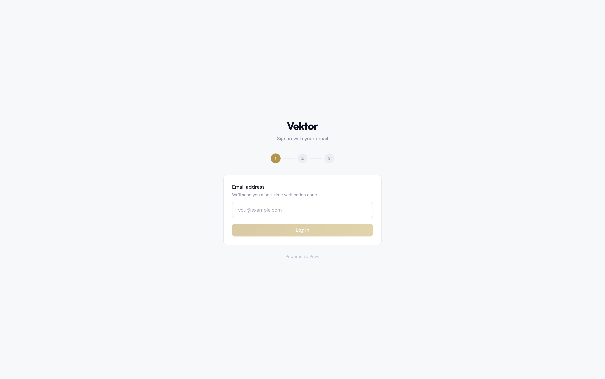
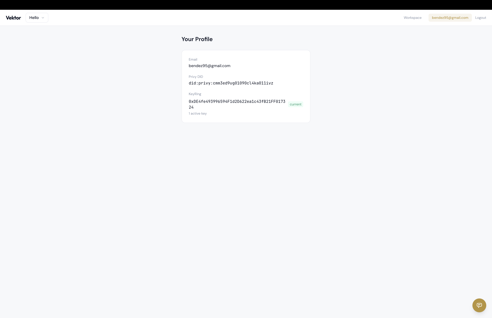
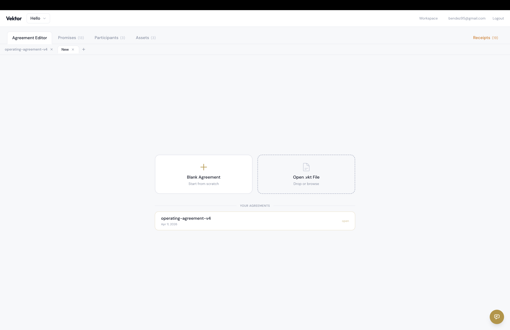
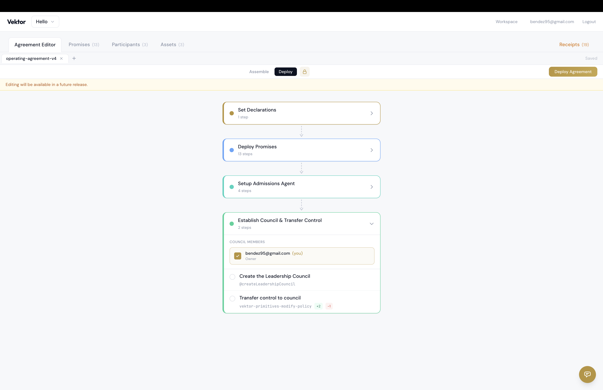
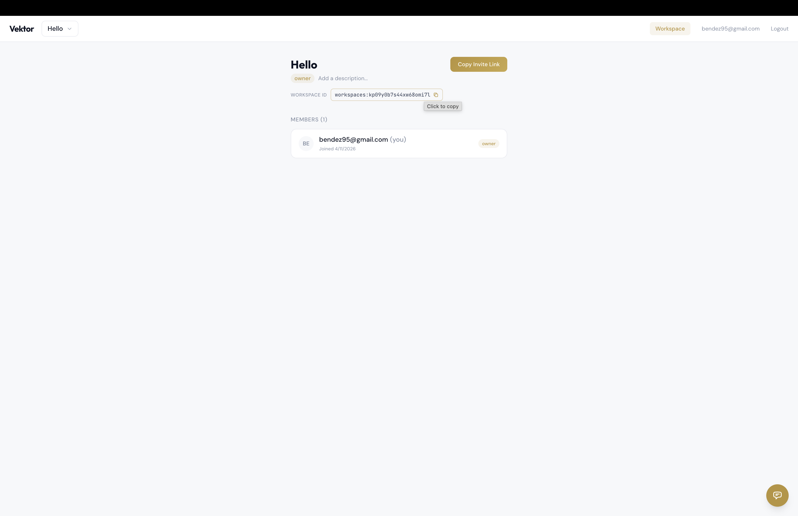
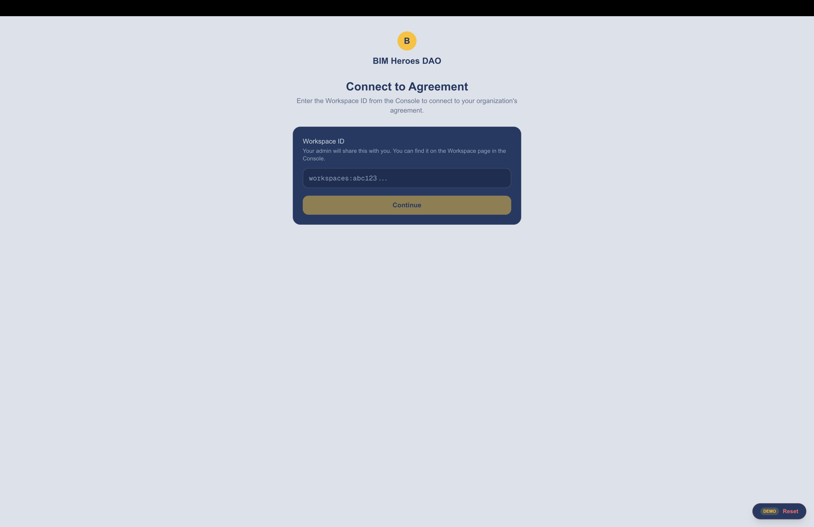
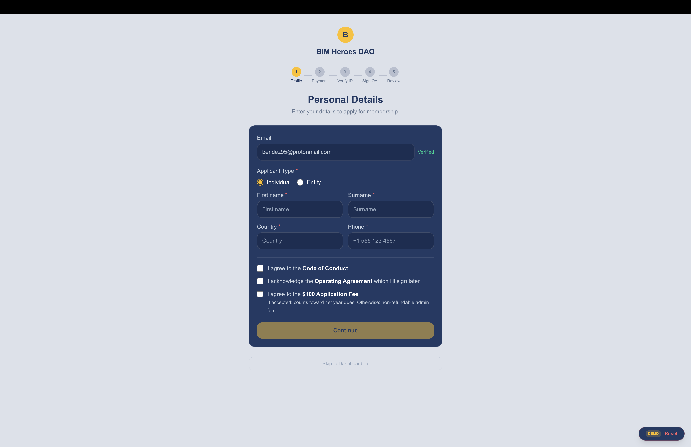
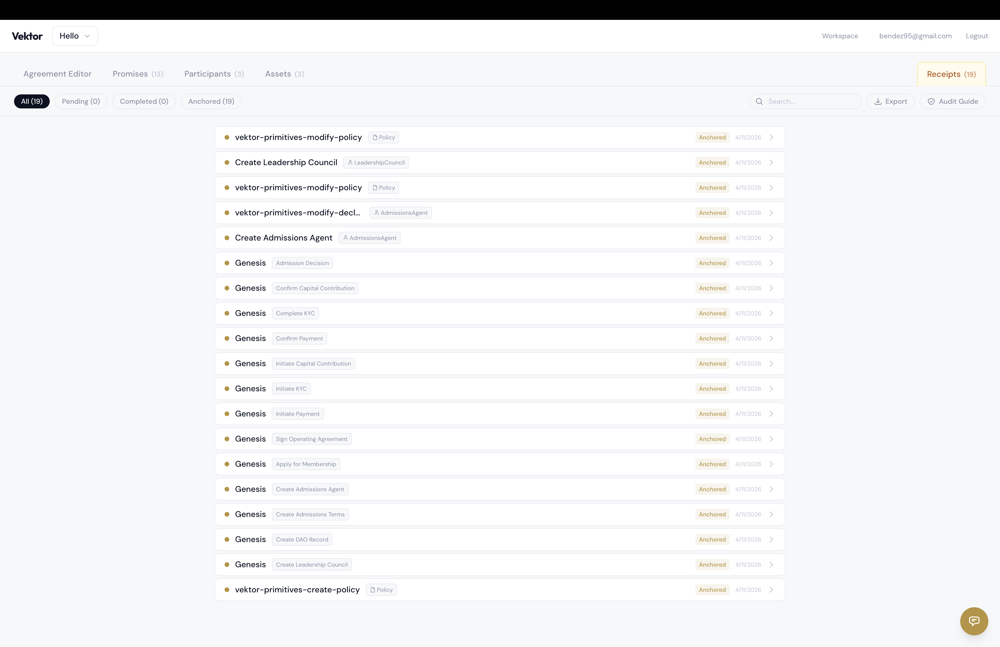

# BIM Hero DAO -- Platform Demo Guide

This guide walks you through deploying the Operating Agreement and onboarding as a member on the Vektor platform. The whole process takes about 10 minutes.

Vektor is the operating system for the DAO. Every decision, every signature, every payment is recorded as an immutable, cryptographically signed receipt. What you're testing is the real governance infrastructure that will run BIM Hero DAO.

---

## 1. Open the Console

Go to: **https://vektor-console-staging.vercel.app**

Log in with your email. A wallet will be created for you automatically -- this is your signing key for all governance actions.

The Console is the **operator's view** -- it's where the leadership council manages agreements, monitors transactions, and verifies the audit trail. Members never see this interface.

### What you see: Your Profile

After logging in, click your email in the top right to see your profile. This shows:

- **Email** -- your login identity
- **Privy DID** -- your decentralized identifier (think of it as your digital passport on the platform)
- **KeyRing** -- your cryptographic public key, used to verify your signatures. "1 active key" means your wallet is set up and ready to sign.

### What you see: The Console tabs

The Console has several tabs along the top:

- **Agreement Editor** -- upload and deploy agreement templates (you'll use this first)
- **Promises** -- the deployed business logic units. Each one handles a specific action like "apply for membership" or "confirm payment." These are the executable parts of the Operating Agreement.
- **Participants** -- people and automated agents in the system. You'll see the Leadership Council, the Admissions Agent (automated), and eventually individual members.
- **Assets** -- records the system tracks: member profiles, capital accounts, the DAO record, admissions policy, and the Policy entity that holds all governance rules. The Policy contains **declarations** -- the access control rules that define who can do what (who can execute a promise, who can see an entity, who can modify governance).
- **Receipts** -- the immutable audit trail. Every action anyone takes becomes a signed receipt here.

## 2. Upload the Operating Agreement

Download the agreement template: **[operating-agreement-v4.vkt](operating-agreement-v4.vkt)**

In the Console, go to the **Agreement Editor** tab. Drag and drop the `.vkt` file into the upload area (or click to browse).

The `.vkt` file is the full Operating Agreement -- both the legal text and the business logic that enforces it. It contains all the rules for membership, payments, KYC, voting, and governance.

## 3. Deploy the Agreement

After uploading, click **Deploy**. You'll see the deployment steps listed as a flowchart. Each step creates a piece of the governance structure:

- Creating the Policy (the central authorization document)
- Creating the DAO Record (legal identity)
- Creating the Leadership Council participant
- Setting up the Admissions Agent
- Deploying each promise (apply, payment, KYC, etc.)

Review the steps, then click **Deploy Agreement**. Wait for all steps to complete (this may take a minute).

This is the moment the Operating Agreement becomes active on the platform. Every step is a signed transaction with its own receipt.

## 4. Copy the Workspace ID

Click **Workspace** in the top navigation bar. Copy the workspace ID -- you'll need it for the next step.

A workspace is an isolated container for one deployment of the agreement. Think of it as "which DAO am I interacting with."

## 5. Open BIM Heroes and Start Onboarding

Go to: **https://vektor-bimheroes-staging-5txpnthcc-bendeworks-2157s-projects.vercel.app/onboarding**

When prompted, paste the workspace ID you copied. This connects the member onboarding app to the agreement you just deployed.

Log in with your email. You'll land on the onboarding screen.

BIM Heroes is the **member-facing experience**. It's what applicants and members see. The Console and BIM Heroes are two views of the same system -- every action a member takes here shows up as a receipt in the Console.

## 6. Walk Through the Onboarding Steps

Follow the steps on screen:

1. **Apply** -- fill in your details, agree to the terms, click Continue
2. **Payment** -- complete the $100 application fee (test mode -- no real charge)
3. **KYC Verification** -- complete the identity check (test mode)
4. **Sign the Operating Agreement** -- review and sign
5. **Done** -- you're onboarded

## 7. Check the Audit Trail

Go back to the Console and open the **Receipts** tab. You'll see every action from the onboarding process listed as a completed, signed receipt.

### Export and Audit Guide

Click **Export** to download all receipts as a file. Click **Audit Guide** for a step-by-step explanation of how to independently verify any receipt.

### Public vs. Private Receipts

Not all receipts are treated the same:

- **Anchored (public)** -- governance actions like creating the DAO, deploying the agreement, and council decisions are permanently published on Base L2 (an Ethereum rollup). Anyone can verify them on-chain. No Vektor account needed -- the data is on the public blockchain.
- **Anchored (private)** -- member-specific actions like applications, payments, and KYC are anchored as a hash only. The hash proves the receipt exists and hasn't been tampered with, but the contents are only visible to authorized participants (the member and the council). This protects personal information while maintaining the audit trail.

This is how the platform provides institutional-grade trust without exposing private data. The council can verify everything. The public can verify governance decisions. But nobody sees a member's personal details unless authorized.

---

## What Just Happened

Every step you completed -- from deploying the agreement to onboarding as a member -- was a signed transaction with an immutable receipt anchored on-chain. The leadership council can verify any of these in the Console. An external auditor can verify the governance receipts directly on Base L2 without needing access to the platform.

---

## Feedback

Use the **chat bubble in the bottom right corner** of the app to report anything -- bugs, confusing steps, suggestions, or questions. You can attach screenshots directly in the chat.
